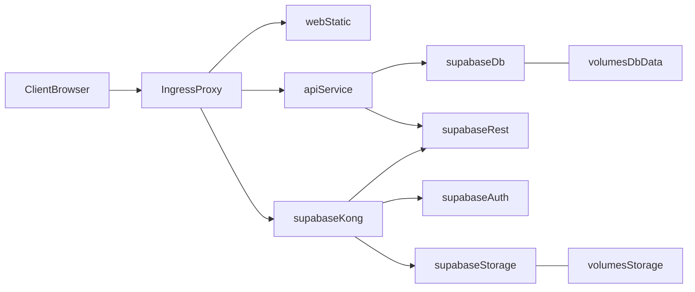

# 单机 Docker Compose（统一入口）+ 迁移自动化计划

## 背景与现状确认

- 目前 Postgres 服务挂载了 `./migrations:/docker-entrypoint-initdb.d`（见 [supabase/docker-compose.yml](supabase/docker-compose.yml)），因此：
  - 仅在数据目录首次初始化（`/var/lib/postgresql/data` 为空，对应宿主机 `supabase/volumes/db/data` 为空）时，会自动执行 `supabase/migrations/*.sql`。
  - 数据卷已存在时，不会再次自动执行，从而出现“更新了 SQL 但没生效”。
- `003_post_auth_setup.sql` 明确要求 auth 启动后手动执行（见 [supabase/migrations/003_post_auth_setup.sql](supabase/migrations/003_post_auth_setup.sql)），不适合放入 initdb 自动跑序列。
- `auto_approve` 字段在 [supabase/migrations/001_multi_tenant.sql](supabase/migrations/001_multi_tenant.sql) 中，初始化数据在 [supabase/migrations/002_init_data.sql](supabase/migrations/002_init_data.sql) 中；若线上缺字段，通常是迁移未被执行或数据库并非首次初始化。

## 范围声明（按你的要求）

- 本计划**不包含**：密钥/密码管理、TLS 证书签发与安全加固、WAF/ACL 等安全配置。

## 新增目标：web + 后端加入 Compose，并统一入口

- 同一台机器上，通过一个统一入口（推荐 Nginx 或 Traefik）对外提供访问：
  - 外部只暴露 80（可选 443）。
  - 路由建议：`/` → web；`/api` → 后端；`/supabase` → Supabase Kong(8000)。
  - web 与后端不直接对外暴露端口，仅通过 docker network 被入口访问。

## 目标

- 在**不清空数据卷**的情况下，Docker 部署能够：
  - 自动执行新增/变更的增量迁移（只执行一次、可追踪）。
  - 自动在 auth 就绪后执行 `003_post_auth_setup.sql`（或同等效果）。
  - 在日志中清晰输出“跑了哪些迁移/跳过哪些迁移/失败原因”。
  - 通过统一入口在单机上稳定提供：web（静态）、api（后端）、supabase（kong/rest/auth/storage）服务。

## 方案概览

采用“**初始化脚本（首次）+ 迁移执行器（每次启动/部署）**”的组合：

- **首次初始化仍由 `000_init.sql` 负责**（保持兼容现状，见 [supabase/migrations/000_init.sql](supabase/migrations/000_init.sql) 注释说明）。
- 新增一个轻量的“迁移执行器”容器/Job：
  - 等待 `db` 健康后连接 Postgres。
  - 维护 `schema_migrations`（或类似）表记录已执行的迁移文件名/校验值/执行时间。
  - 按文件名排序扫描 `supabase/migrations/*.sql`，对未执行的进行执行。
  - 对 `003_post_auth_setup.sql`：额外等待 auth 就绪（或检查 `auth.users` 存在）后再执行。
- 新增“应用栈 compose”（不复制 Supabase 服务定义，复用其 network）：
  - 方式 A（推荐）：在仓库根目录新增 `docker-compose.prod.yml`（或 `deploy/docker-compose.app.yml`），通过 `docker compose -f supabase/docker-compose.yml -f docker-compose.prod.yml up -d` 叠加启动。
  - `reverse-proxy`、`api`、`web` 三个服务加入 `supabase-network`，用服务名访问 `kong/rest/db`，避免硬编码 `127.0.0.1`。

## 关键设计细节

- **迁移追踪表**：建议放在 `public.schema_migrations`，字段包含：`filename`（唯一）、`checksum`（可选）、`applied_at`、`success`、`error`（可选）。
- **幂等性要求**：迁移脚本尽量使用 `IF NOT EXISTS` / `CREATE OR REPLACE` / `DROP ... IF EXISTS` / `ON CONFLICT DO NOTHING`，避免重复执行出错。
  - 你们的 `001_multi_tenant.sql`、`002_init_data.sql` 已大量采用类似写法，可继续保持。
- **003 执行条件**：以脚本内部检查为准（当前已检查 `auth.users` 是否存在）。迁移执行器需：
  - 轮询等待 `auth` 服务健康（或直接轮询 DB 内 `information_schema.tables` 是否存在 `auth.users`）。
  - 达到条件再执行 003；否则持续等待或以明确日志退出。

## 验证与回滚策略

- **验证**：
  - 新增迁移文件后，重启/重新部署（不删数据卷），确认迁移执行器日志显示已应用。
  - 在 DB 内核对目标字段/表（例如 `document_templates.auto_approve`）。
  - 对 003：核对 `auth.users` 上的 trigger 是否存在。
  - 统一入口访问验证：`/`（web）、`/api/`*（后端）、`/supabase/`*（Supabase 网关）均可达。
- **回滚**：SQL 迁移天然难完全自动回滚；建议每次发布前做数据库备份（内网也建议做），并为破坏性迁移提供对应的 down 脚本（仅在需要时执行）。

## 文档更新

- 更新 [supabase/README.md](supabase/README.md)：
  - 区分“首次初始化（initdb 自动执行）”与“后续增量迁移（迁移执行器自动执行）”。
  - 明确 003 将被自动化处理，不再要求人工执行（或保留人工兜底命令）。
- 新增全栈部署说明（建议新增到仓库根 `README` 或 `deploy/README.md`）：
  - 单机启动命令（两份 compose 叠加）
  - 服务入口与路由（/、/api、/supabase）
  - 数据卷位置（db/storage）

