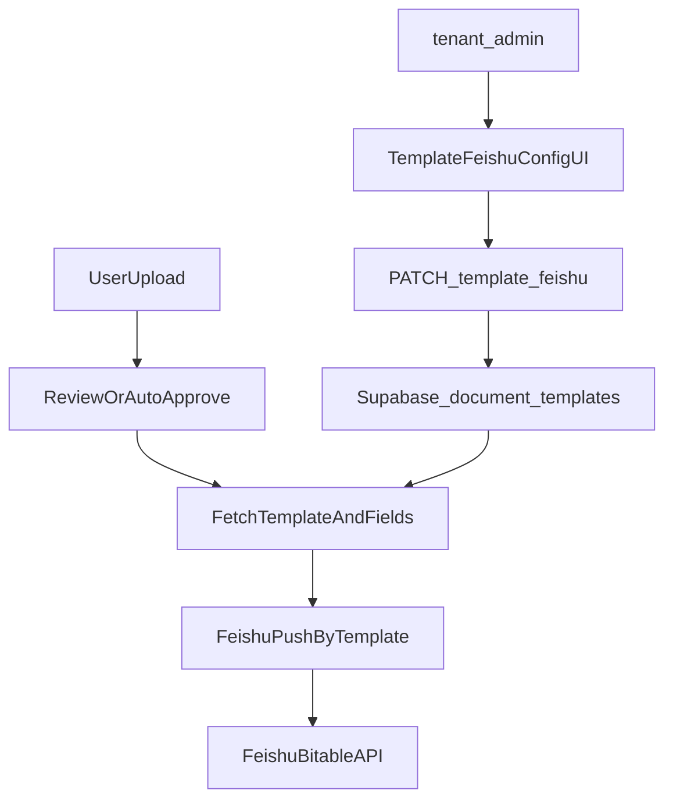

## 目标与原则

- **目标**：飞书推送的多维表格链接（`app_token`/`table_id`）允许“每个租户的管理员”自主配置，避免所有配置都依赖超管；同时保证越权不可发生。
- **原则**：
  - **凭证不下放**：`FEISHU_APP_ID`/`FEISHU_APP_SECRET` 仍由系统统一在环境变量管理。
  - **配置下放**：仅下放可替换的目标表位置（`app_token`/`table_id`）给 `tenant_admin`。
  - **最小改动**：优先复用现有多租户表结构与 RLS。

## 现状对齐（已具备的基础）

- 数据库已在 `document_templates` 里预留每模板推送目的地：`feishu_bitable_token`、`feishu_table_id`。
  - 参考：`supabase/migrations/001_multi_tenant.sql` 第 56-59 行。
- RLS 已允许 `tenant_admin` 管理自己租户的 `document_templates`。
  - 参考：`supabase/migrations/001_multi_tenant.sql` 第 249-255 行。
- 飞书推送服务已支持按模板推送：`FeishuService.push_by_template(data, field_mapping, bitable_token, table_id)`。
  - 参考：`services/feishu_service.py` 第 347-386 行。

## 方案形态（推荐：按“模板”配置）

- **配置粒度**：按 `document_templates` 配置（你们系统里模板已经是业务入口，且字段映射也按模板管理）。
- **权限**：
  - `tenant_admin`：只能查看/修改本租户模板的飞书配置。
  - `super_admin`：可跨租户查看/修改。
  - 普通 `user`：只读（可看推送结果，不可改配置）。

## 后端改造计划（API + 校验 + 可观测性）

- 在后端增加“模板飞书配置管理”接口（建议放在模板相关 routes 下）：
  - **GET** `/api/templates/{template_id}`：返回模板详情（包含当前 `feishu_bitable_token`/`feishu_table_id`）。
  - **PATCH** `/api/templates/{template_id}/feishu`：更新 `feishu_bitable_token`/`feishu_table_id`。
  - **POST** `/api/templates/{template_id}/feishu/test`：使用当前配置做一次“最小权限校验”的测试（不写入或写入测试记录二选一）。
- 校验规则：
  - `app_token`/`table_id` 非空、长度基本校验；保存前可选做轻量 test。
  - 对错误码做友好提示（你们已有 `99991663` 等错误分类）。
- 可观测性：
  - 在推送失败日志中打印 `template_id`/`tenant_id`/错误码，便于定位。

**涉及文件（重点）**

- `[services/feishu_service.py](services/feishu_service.py)`：
  - 复用 `push_by_template`；补充一个 `test_bitable_access(bitable_token, table_id)`（调用飞书 bitable 读接口或写一条临时记录后删除）。
- `[api/dependencies/auth.py](api/dependencies/auth.py)`：
  - 复用 `current_user.is_tenant_admin()` 做权限门禁。
- 模板相关路由（需在代码中定位现有模板路由；若缺失则新增，例如 `api/routes/templates.py` 并在主 router 注册）。

## 前端改造计划（配置页/入口/权限态）

- 增加一个仅 `tenant_admin`/`super_admin` 可见的“模板配置-飞书推送”区块：
  - 输入 `多维表格 Token` 与 `数据表 ID`。
  - 按钮：**测试连接**、**保存**。
  - 提示：需要在飞书开发者后台给应用开通 `bitable` 相关权限并把该多维表格授权给应用。
- UX 细节：
  - 保存前先 test；test 通过再允许保存（或保存后提示 test 结果）。
  - 对常见错误码给出中文可操作建议。

**涉及文件（可能）**

- 你们已有 `useProfile`/store 角色态：`web/src/hooks/useProfile.ts`、`web/src/store/useStore.ts`（从搜索结果可见）。
- 新增或扩展模板管理页（需在 `web/src/pages/` 定位模板页；若没有则新增管理页并加到路由/菜单）。

## 推送链路调整（让配置真正生效）

- 在“文档审核通过/自动通过并推送”的逻辑处：
  - 读取当前文档关联的 `template_id` → 获取该模板的 `feishu_bitable_token`/`feishu_table_id` + 字段映射（`template_fields.feishu_column`）→ 调用 `push_by_template`。
- 保留兼容：
  - 若模板未配置 `feishu_`*，则根据业务选择：
    - **方案 A（更安全）**：直接不推送并提示“未配置”。
    - **方案 B（向后兼容）**：回退到环境变量 `FEISHU_BITABLE_APP_TOKEN/FEISHU_BITABLE_TABLE_ID`（你们当前 `.env` 有默认配置）。

## 数据与权限安全

- 仅存储 `app_token`/`table_id` 到业务表，不存储 `app_secret`。
- 依赖 Supabase RLS 确保 tenant 隔离；后端仍做角色校验（防止 service key 场景下绕过前端）。
- 可选增强：对 `document_templates` 的飞书字段变更做审计（记录操作人/时间/旧值摘要）。

## 验收与回滚

- 验收用例：
  - `tenant_admin` 能修改本租户模板配置；不能修改其他租户模板。
  - 普通 `user` 不能看到/不能保存该配置。
  - 配置正确时推送成功；配置错误时返回明确错误（权限不足、表不存在、字段类型不匹配）。
- 回滚策略：
  - 仅前端隐藏入口 + 后端接口禁用即可；数据保留不影响原默认环境变量推送（若采用兼容回退）。

## 数据流示意（Mermaid）

