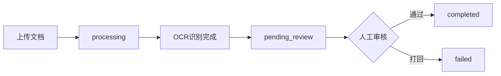

# OCR强制审核功能实现计划

## 需求概述

- OCR识别完成后，文档进入"待审核"状态（而非直接完成）
- 添加新状态 `pending_review`（待审核）
- 测试单的"检验结论"字段在未审核状态下高亮显示
- 审核通过后状态变为 `completed`，高亮效果消失

## 整体流程



## 一、后端修改

### 1. 修改数据库初始化SQL（测试环境直接改）

修改 [supabase/migrations/001_init.sql.manual](supabase/migrations/001_init.sql.manual) 第25-27行

```sql
-- 原来的约束
status VARCHAR(50) DEFAULT 'pending' CHECK (status IN (
    'pending', 'uploaded', 'processing', 'completed', 'failed'
)),

-- 改为（添加 pending_review）
status VARCHAR(50) DEFAULT 'pending' CHECK (status IN (
    'pending', 'uploaded', 'processing', 'pending_review', 'completed', 'failed'
)),
```

> 注意：修改后需要重建数据库（删除旧数据重新初始化）

### 2. 修改处理流程

[api/routes/documents/process.py](api/routes/documents/process.py) - `process_document_task` 函数

- 将处理完成后的状态从 `completed` 改为 `pending_review`
- 关键代码位置：第125行左右

### 3. 修改审核流程

[api/routes/documents/review.py](api/routes/documents/review.py) - `validate_document` 函数

- 审核通过后更新 documents 表状态为 `completed`
- 在更新提取结果表的同时，更新主文档状态

## 二、前端修改

### 1. 类型定义

[web/src/types/index.ts](web/src/types/index.ts)

```typescript
// 第23行，添加 pending_review 状态
export type DocumentStatus = 'pending' | 'uploaded' | 'processing' | 'pending_review' | 'completed' | 'failed'
```

### 2. 工具函数

[web/src/lib/utils.ts](web/src/lib/utils.ts)

- `getStatusColor`：添加 `pending_review` 的颜色（建议橙色/amber）
- `getStatusText`：添加 `pending_review` 的中文文本"待审核"

### 3. 文档列表页

[web/src/pages/Documents.tsx](web/src/pages/Documents.tsx)

- 第100-106行：筛选器添加"待审核"选项

### 4. 文档详情页（核心高亮逻辑）

[web/src/pages/DocumentDetail.tsx](web/src/pages/DocumentDetail.tsx)

- 判断条件：`status === 'pending_review' && document_type === '测试单' && field.key === 'inspection_conclusion'`
- 高亮样式：背景色 + 边框闪烁动画
- 审核通过后（status === 'completed'）正常显示

## 三、修改文件清单

- `supabase/migrations/001_init.sql.manual` - 修改 status 约束，添加 pending_review
- `api/routes/documents/process.py` - 修改处理完成后的状态为 pending_review
- `api/routes/documents/review.py` - 审核通过后更新文档状态为 completed
- `web/src/types/index.ts` - 添加 pending_review 类型
- `web/src/lib/utils.ts` - 添加状态颜色和文本
- `web/src/pages/Documents.tsx` - 筛选器添加待审核选项
- `web/src/pages/DocumentDetail.tsx` - 检验结论字段高亮逻辑