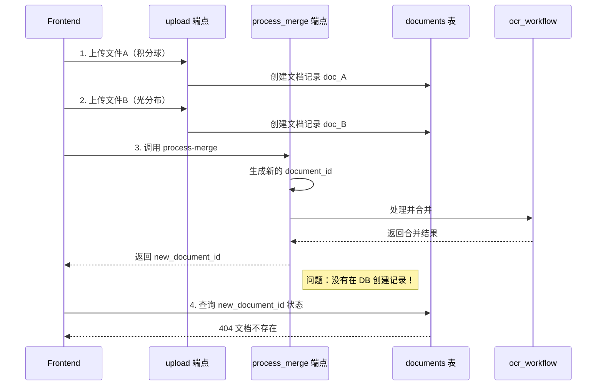

# 修复合并模式文档查询404问题

## 问题分析

### 当前流程（有Bug）



### 问题根源

在 [api/routes/documents/process.py](api/routes/documents/process.py) 第387-445行的 `process_merge_documents` 函数中：

- 第429行生成了新的 `document_id`
- 调用 `ocr_workflow.process_merge()` 处理
- **没有在 documents 表中创建对应的记录**
- 直接返回结果给前端

## 修复方案

### 1. 创建照明提取结果表

在 [supabase/migrations/](supabase/migrations/) 下创建新的迁移文件 `009_lighting_reports.sql`：

```sql
-- 照明综合报告提取结果表
CREATE TABLE IF NOT EXISTS lighting_reports (
    id UUID DEFAULT gen_random_uuid() PRIMARY KEY,
    document_id UUID REFERENCES documents(id) ON DELETE CASCADE,
    -- 来自积分球（14个字段）
    sample_model VARCHAR(255),           -- 样品型号
    chromaticity_x VARCHAR(64),          -- 色品坐标X
    chromaticity_y VARCHAR(64),          -- 色品坐标Y
    duv VARCHAR(64),                     -- duv
    cct VARCHAR(64),                     -- 色温(CCT)
    ra VARCHAR(64),                      -- Ra
    r9 VARCHAR(64),                      -- R9
    cqs VARCHAR(64),                     -- CQS
    sdcm VARCHAR(64),                    -- 色容差SDCM
    power_sphere VARCHAR(64),            -- 功率(积分球)
    luminous_flux_sphere VARCHAR(64),    -- 光通量(积分球)
    luminous_efficacy_sphere VARCHAR(64),-- 光效(积分球)
    rf VARCHAR(64),                      -- Rf
    rg VARCHAR(64),                      -- Rg
    -- 来自光分布（6个字段）
    lamp_specification VARCHAR(255),     -- 灯具规格
    power VARCHAR(64),                   -- 功率
    luminous_flux VARCHAR(64),           -- 光通量(光分布)
    luminous_efficacy VARCHAR(64),       -- 光效(光分布)
    peak_intensity VARCHAR(64),          -- 峰值光强
    beam_angle VARCHAR(64),              -- 光束角
    -- 元数据
    extraction_confidence FLOAT,
    extraction_version VARCHAR(50) DEFAULT '1.0',
    raw_extraction_data JSONB,
    is_validated BOOLEAN DEFAULT FALSE,
    validated_by UUID,
    validated_at TIMESTAMP WITH TIME ZONE,
    validation_notes TEXT,
    created_at TIMESTAMP WITH TIME ZONE DEFAULT NOW(),
    updated_at TIMESTAMP WITH TIME ZONE DEFAULT NOW(),
    CONSTRAINT lighting_reports_document_unique UNIQUE(document_id)
);
```

### 2. documents 表添加关联字段

在 documents 表中添加 `source_document_ids` 字段，用于记录合并文档的原始文档ID：

```sql
ALTER TABLE documents ADD COLUMN IF NOT EXISTS source_document_ids UUID[];
```

### 3. 隐藏子模板（前端不显示）

将"积分球测试"和"光分布测试"子模板设为不可见，前端只显示"照明综合报告"：

```sql
-- 隐藏子模板，只保留合并模板供用户选择
UPDATE document_templates 
SET is_active = FALSE 
WHERE code IN ('integrating_sphere', 'light_distribution');
```

### 4. 修改 supabase_service.py

在 [services/supabase_service.py](services/supabase_service.py) 中：

- `get_table_name()` 添加照明综合报告的映射
- `save_extraction_result()` 添加对照明综合报告的支持
- 新增 `save_lighting_report()` 方法

### 5. 修改 process.py

在 [api/routes/documents/process.py](api/routes/documents/process.py) 的 `process_merge_documents` 函数中，处理成功后：

```python
# 处理成功后，创建文档记录并保存结果
if result.get("success") and result.get("extraction_data"):
    # 1. 获取原始上传文档的ID
    source_doc_ids = []
    for file_info in request.files:
        # 从 file_path 查找对应的 document_id
        doc = await supabase_service.get_document_by_file_path(file_info.file_path)
        if doc:
            source_doc_ids.append(doc["id"])
    
    # 2. 创建合并文档记录
    merged_doc_data = {
        "id": document_id,
        "user_id": user.user_id,
        "tenant_id": user.tenant_id,
        "template_id": request.template_id,
        "document_type": result.get("template_name"),
        "status": "pending_review",
        "original_file_name": f"合并文档_{template.get('name')}",
        "file_name": f"merged_{document_id}",
        "file_path": "",  # 合并文档无实体文件
        "source_document_ids": source_doc_ids,  # 关联原始文档
        "processed_at": datetime.now().isoformat(),
    }
    await supabase_service.create_document(merged_doc_data)
    
    # 3. 更新原始文档状态，关联到合并文档
    for src_id in source_doc_ids:
        await supabase_service.update_document(src_id, {
            "status": "merged",
            "merged_to_document_id": document_id
        })
    
    # 4. 保存提取结果
    await supabase_service.save_extraction_result(
        document_id=document_id,
        document_type=result.get("template_name", "未知"),
        extraction_data=result["extraction_data"]
    )

return result
```

## 预期效果

修复后：

- 合并处理完成时会在 documents 表中创建记录
- 前端查询文档状态时能够正常返回数据
- 原始上传的文档与合并文档建立关联关系
- 提取结果保存到专用的 lighting_reports 表