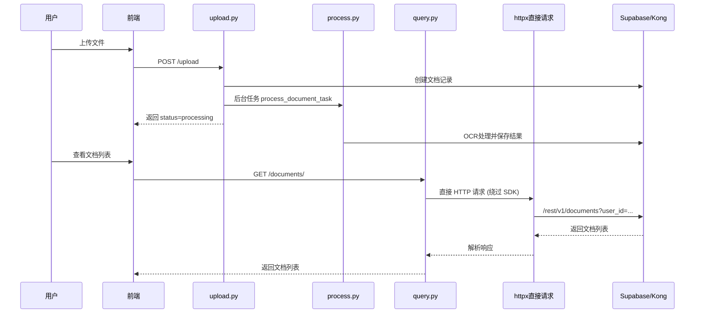

# 修复文档查询与 OCR 自动处理

## 问题根因

### 问题 1: 用户看不到自己的文档

- **原因**: supabase-py 2.11.0 SDK 与本地 Kong 网关存在兼容性问题
- **现象**: 直接 HTTP 请求成功，但 SDK 的 `table().select().execute()` 返回 "Not Found"
- **影响范围**: 所有使用 `get_user_client()` 的查询都失败

### 问题 2: 上传没有触发 OCR

- **原因**: `upload.py` 设计上不自动处理，状态只设为 `uploaded`
- **影响**: 用户上传后需要手动调用 `/process` 接口

## 解决方案

### 方案 A: 绕过 SDK 直接使用 httpx (推荐)

在 [services/supabase_service.py](services/supabase_service.py) 中添加基于 httpx 的查询方法，绕过 SDK 的问题：

```python
import httpx

def query_as_user(self, table: str, user_token: str, **kwargs) -> List[Dict]:
    """使用 httpx 直接查询，绕过 SDK 兼容性问题"""
    url = f"{settings.SUPABASE_URL}/rest/v1/{table}"
    headers = {
        "apikey": settings.SUPABASE_ANON_KEY,
        "Authorization": f"Bearer {user_token}",
    }
    # 构建查询参数...
```

### 方案 B: 修改 upload.py 添加自动处理

在 [api/routes/documents/upload.py](api/routes/documents/upload.py) 中：

1. 导入 `BackgroundTasks` 和 `process_document_task`
2. 上传成功后自动添加后台处理任务

## 修改文件清单

### 1. [services/supabase_service.py](services/supabase_service.py)

添加 httpx 直接查询方法：

- `query_table_as_user()` - 带 RLS 的表查询
- `get_document_as_user()` - 获取单个文档
- `list_documents_as_user()` - 列出用户文档

### 2. [api/dependencies/auth.py](api/dependencies/auth.py)

修改 `get_user_client()` 或添加新的辅助函数，使用 httpx 方法替代 SDK

### 3. [api/routes/documents/query.py](api/routes/documents/query.py)

更新所有端点使用新的查询方法

### 4. [api/routes/documents/upload.py](api/routes/documents/upload.py)

添加自动 OCR 处理：

```python
from fastapi import BackgroundTasks
from .process import process_document_task

@router.post("/upload")
async def upload_document(
    file: UploadFile = File(...),
    background_tasks: BackgroundTasks,  # 新增
    ...
):
    # 现有上传逻辑...
    
    # 新增：自动触发 OCR 处理
    background_tasks.add_task(
        process_document_task,
        document_id=document_id,
        file_path=file_path
    )
    await supabase_service.update_document_status(document_id, "processing")
    
    return {
        "document_id": document_id,
        "status": "processing",  # 改为 processing
        "message": "文档上传成功，正在处理中",
        ...
    }
```

## 数据流修复后



## 验证步骤

1. 运行 `test_supabase_client.py` 确认 httpx 直接请求可行
2. 重启后端服务
3. 前端上传新文件，确认自动触发处理
4. 登录后查看文档列表，确认能看到自己的文档