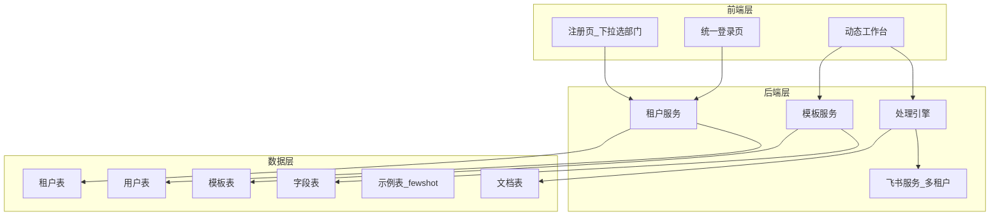

# 多租户配置化系统实施方案

## 一、整体架构



## 二、数据库设计

### 2.1 新增表结构

**租户表 (tenants)**

- 存储部门基础信息（飞书应用凭证共用，保留在 settings.py）
- 字段: id, name, code, is_active, created_at
- 所有租户共用同一个飞书应用，只是推送到不同的多维表格

**文档模板表 (document_templates)**

- 每个租户可配置多个文档模板
- 字段: id, tenant_id, name, code, process_mode(single/merge), required_doc_count, feishu_bitable_token, feishu_table_id, is_active
- **single 模式**：直接使用本模板的字段和 few-shot 进行提取
- **merge 模式**：本模板作为"合并模板"，通过 merge_rules 引用两个子模板，各自提取后合并输出

**模板字段表 (template_fields)**

- 定义每个模板需要提取的字段和飞书列映射
- 字段: id, template_id, field_key, field_label, feishu_column, field_type, is_required, source_doc_type, sort_order

**模板示例表 (template_examples)** - 存储 few-shot 示例

- 每个模板可配置多个 few-shot 示例，用于提高 LLM 提取准确率
- 字段: id, template_id, example_input(示例OCR文本), example_output(期望JSON结果), sort_order, is_active
- 不同部门/模板可以有完全不同的示例，适配各自的文档格式

**合并规则表 (template_merge_rules)** - 用于照明事业部双报告合并输出

- 定义 merge 模式下如何组合两份文档的提取结果
- 字段: id, template_id, doc_type_a, doc_type_b, sub_template_a_id, sub_template_b_id
- sub_template_a_id/b_id 分别指向两份文档各自的提取模板（含独立的字段和few-shot）
- merge 流程：分别提取 → 合并字段 → 一条记录推送飞书

### 2.2 现有表改造

**用户表 (auth.users)**

- 新增字段: tenant_id (关联租户)
- 新增字段: role (角色：super_admin / tenant_admin / user)

**文档表 (documents)**

- 新增字段: tenant_id, template_id

## 三、后端服务改造

### 3.1 新增服务

**租户服务** `services/tenant_service.py`

- get_tenant(tenant_id): 获取租户信息
- get_tenant_by_code(code): 根据代码获取租户
- get_all_tenants(): 获取所有租户（注册页下拉用）
- get_tenant_by_user(user_id): 根据用户获取所属租户

**模板服务** `services/template_service.py`

- get_tenant_templates(tenant_id): 获取租户的所有模板
- get_template_by_code(tenant_id, code): 获取指定模板、字段及 few-shot 示例
- get_template_examples(template_id): 获取模板的 few-shot 示例列表
- build_extraction_prompt(template, ocr_text): 根据模板字段 + few-shot 示例动态构建 LLM 提示词

### 3.2 改造现有服务

**飞书服务** `services/feishu_service.py`

- 移除硬编码的 FIELD_MAPPING
- 新增 push_by_template(tenant_id, template_code, data) 方法
- Token 按租户分别缓存

**认证服务** `api/dependencies/auth.py`

- 注册接口增加 tenant_id 参数
- 登录后返回用户的租户信息

### 3.3 处理引擎改造

**处理引擎** `agents/workflow.py`

- 根据模板配置动态提取字段
- **single 模式**：单文档 → OCR → LLM提取 → 推送飞书
- **merge 模式**（照明事业部场景）：

  1. 用户选择文档类型（积分球/光分布/积分球+光分布）
  2. 上传 1-2 份文档（支持只上传一种）
  3. 分别进行 OCR 识别
  4. **分别**用各自的子模板进行 LLM 提取（不同的字段、不同的 few-shot）
  5. 合并提取结果（缺失的文档类型字段留空）
  6. 推送到飞书多维表格（一行包含所有字段，未上传的留空）

## 四、前端界面改造

### 4.1 注册页面

文件: `web/src/pages/Register.tsx`

- 增加"所属部门"下拉选择框
- 调用 /api/tenants 获取部门列表
- 注册时提交 tenant_id

### 4.2 登录后动态界面

文件: `web/src/pages/Dashboard.tsx`, `web/src/pages/Upload.tsx`

- 从用户信息获取 tenant 配置
- 动态显示租户名称
- 动态加载该租户的文档模板列表

### 4.3 上传页面

文件: `web/src/pages/Upload.tsx`

- 根据模板显示支持的文档类型
- merge 模式支持多文件上传
- 动态显示该模板需要提取的字段预览

## 五、API 接口设计

| 接口 | 方法 | 描述 |

|------|------|------|

| /api/tenants | GET | 获取所有租户（注册页用） |

| /api/auth/register | POST | 注册（含tenant_id） |

| /api/templates | GET | 获取当前租户的模板列表 |

| /api/templates/{code} | GET | 获取模板详情及字段 |

| /api/documents | GET | 获取文档列表（自动按租户过滤） |

## 六、数据隔离与角色权限

### 6.1 角色定义

| 角色 | 代码 | 文档查看范围 | 管理权限 |

|------|------|-------------|---------|

| 超级管理员 | super_admin | 所有部门所有文档 | 管理所有租户、模板、用户 |

| 部门管理员 | tenant_admin | 本部门所有人的文档 | 管理本部门模板配置 |

| 普通用户 | user | 仅自己上传的文档 | 无 |

### 6.2 数据过滤规则

- **super_admin**: 不过滤，查看所有数据
- **tenant_admin**: 按 tenant_id 过滤，查看本部门所有数据
- **user**: 按 tenant_id + user_id 过滤，只看自己的数据

### 6.3 RLS 策略示例

```sql
-- 文档表 RLS 策略
CREATE POLICY documents_select ON documents FOR SELECT USING (
  CASE 
    WHEN current_user_role() = 'super_admin' THEN true
    WHEN current_user_role() = 'tenant_admin' THEN tenant_id = current_user_tenant()
    ELSE tenant_id = current_user_tenant() AND user_id = auth.uid()
  END
);
```

## 七、管理员后台

### 7.1 后台功能

- 租户管理：增删改查租户
- 模板管理：配置文档模板、字段定义、few-shot 示例
- 用户管理：查看用户列表、分配租户
- 推送日志：查看飞书推送记录

### 7.2 管理员 API

| 接口 | 方法 | 描述 |

|------|------|------|

| /api/admin/tenants | GET/POST | 租户列表/新增 |

| /api/admin/tenants/{id} | PUT/DELETE | 修改/删除租户 |

| /api/admin/templates | GET/POST | 模板列表/新增 |

| /api/admin/templates/{id}/fields | GET/POST | 模板字段管理 |

| /api/admin/templates/{id}/examples | GET/POST | few-shot 示例管理 |

| /api/admin/users | GET | 用户列表 |

| /api/admin/users/{id}/tenant | PUT | 分配用户租户 |

## 八、数据迁移

- 现有用户的 tenant_id 设为质量运营部（默认租户）
- 现有文档的 tenant_id 设为质量运营部
- 迁移脚本需要在新表创建后执行

## 九、配置示例

**质量运营租户配置:**

- 模板: 测试单、快递单、抽样单
- 模式: 单文档处理
- 飞书: 推送到质量运营的多维表格

**照明事业部租户配置:**

- 子模板A: 积分球模板（有自己的字段定义和 few-shot）
- 子模板B: 光分布模板（有自己的字段定义和 few-shot）
- 合并模板: 积分球+光分布合并（引用子模板A和B）
- 模式: merge（支持上传 1-2 份，缺失的留空）
- 飞书: 推送到照明事业部的多维表格（一行包含积分球+光分布所有字段）