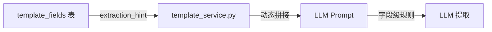

# 字段级提取规则可配置化

## 背景

当前 prompt 的字段说明只有 `field_type` 衍生的类型提示（日期/数值），无法为单个字段配置特殊规则（如 sdcm 字段要求"仅数值，不带单位"）。

## 改动范围

### 1. 数据库表结构

在 `template_fields` 表增加 `extraction_hint` 列：

```sql
ALTER TABLE template_fields 
ADD COLUMN extraction_hint TEXT;  -- 字段级提取提示，如"仅数值，不带单位"
```

新建迁移文件 [supabase/migrations/003_field_extraction_hint.sql](supabase/migrations/003_field_extraction_hint.sql)

### 2. Prompt 构建逻辑

修改 [services/template_service.py](services/template_service.py) 的 `build_extraction_prompt` 方法：

```python
# 当前逻辑（L301-L312）
for i, field in enumerate(fields, 1):
    field_key = field.get("field_key", "")
    field_label = field.get("field_label", "")
    field_type = field.get("field_type", "text")
    extraction_hint = field.get("extraction_hint", "")  # 新增
    
    type_hint = ""
    if field_type == "date":
        type_hint = "（日期格式：YYYY-MM-DD）"
    elif field_type == "number":
        type_hint = "（数值类型）"
    
    # 合并 type_hint 和 extraction_hint
    hint = f"{type_hint} {extraction_hint}".strip()
    field_lines.append(f"| {i} | {field_label} | {field_key} | {hint}")
```

### 3. 初始化数据

在迁移文件中为 sdcm 字段配置规则：

```sql
UPDATE template_fields 
SET extraction_hint = '仅数值，不带单位' 
WHERE field_key = 'sdcm';
```

## 生成的 Prompt 效果对比

**改动前：**

```
| 9 | 色容差SDCM | sdcm | |
```

**改动后：**

```
| 9 | 色容差SDCM | sdcm | 仅数值，不带单位 |
```

## 数据流

