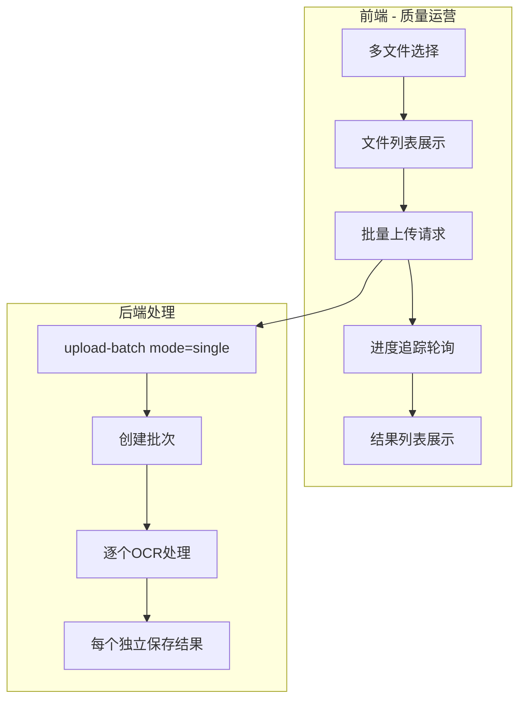
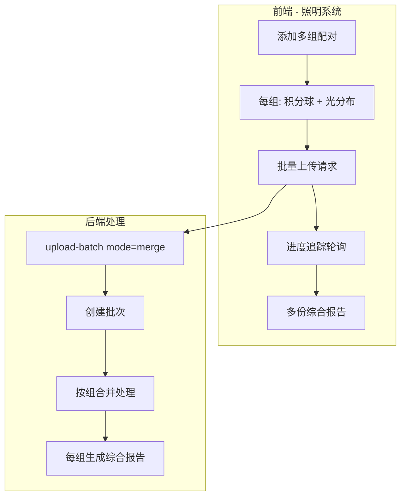

# 批量上传OCR识别功能实现计划

## 现状分析

当前系统支持两种上传模式：

- **质量运营 (quality_auto)**：单文件上传 + 自动识别
- **照明系统 (lighting_merge)**：固定两文件合并模式（积分球 + 光分布）

批量上传需要同时支持两种场景：

- **质量运营批量**：一次上传多份独立文档（检测报告/快递单/抽样单），每个文件独立识别
- **照明系统批量**：一次上传多组配对文件，每组（积分球 + 光分布）生成一份综合报告

## 系统架构

### 质量运营批量模式



### 照明系统批量模式



**照明多样品处理说明**：

积分球PDF可能有多页（每页一个样品），系统会逐页处理：

```
批量上传示例：3组配对

组1: 积分球A.pdf(2页) + 光分布A.pdf
     ├─ 积分球第1页 OCR → 提取样品1数据
     ├─ 积分球第2页 OCR → 提取样品2数据
     ├─ 光分布 OCR → 提取光分布数据
     └─ 合并 → 1个文档，extraction_results=[样品1+光分布, 样品2+光分布]

组2: 积分球B.pdf(1页) + 光分布B.pdf
     └─ 合并 → 1个文档，extraction_results=[样品1+光分布]

组3: 积分球C.pdf(2页) + 光分布C.pdf
     └─ 合并 → 1个文档，extraction_results=[样品1+光分布, 样品2+光分布]

批次结果：3个文档记录，共5条样品数据
进度显示：2/3 组已完成（按组计算，不按样品）
```

这复用了现有的 `process_merge` + `process_document_per_page` 逻辑，无需额外开发多样品支持。

## 实现方案

### 1. 数据库：添加批次表

在 `supabase/migrations/` 创建新迁移文件 `005_batch_upload.sql`：

```sql
CREATE TABLE document_batches (
    id UUID DEFAULT gen_random_uuid() PRIMARY KEY,
    user_id UUID NOT NULL,
    tenant_id UUID REFERENCES tenants(id),
    -- 批次模式：single=质量运营独立处理, merge=照明配对合并
    batch_mode VARCHAR(20) DEFAULT 'single' CHECK (batch_mode IN ('single', 'merge')),
    -- 对于 merge 模式，total_count 是组数而非文件数
    total_count INT NOT NULL DEFAULT 0,
    completed_count INT NOT NULL DEFAULT 0,
    failed_count INT NOT NULL DEFAULT 0,
    status VARCHAR(50) DEFAULT 'pending' CHECK (status IN (
        'pending', 'processing', 'completed', 'partial_failed'
    )),
    created_at TIMESTAMP WITH TIME ZONE DEFAULT NOW(),
    completed_at TIMESTAMP WITH TIME ZONE
);

-- documents 表添加批次关联字段和组号
ALTER TABLE documents ADD COLUMN batch_id UUID REFERENCES document_batches(id);
ALTER TABLE documents ADD COLUMN batch_group_index INT;  -- 用于 merge 模式，标识属于哪一组
CREATE INDEX idx_documents_batch_id ON documents(batch_id);
CREATE INDEX idx_documents_batch_group ON documents(batch_id, batch_group_index);
```

### 2. 后端：新增批量上传API

**文件**: [api/routes/documents/upload.py](api/routes/documents/upload.py)

新增端点 `POST /api/documents/upload-batch`，支持两种模式：

```python
@router.post("/upload-batch")
async def upload_batch(
    files: List[UploadFile] = File(...),
    mode: str = Form("single"),  # "single" 或 "merge"
    groups: Optional[str] = Form(None),  # merge模式：JSON格式的分组信息
    user: CurrentUser = Depends(get_current_user),
    background_tasks: BackgroundTasks
):
    """
    批量上传文档
    
    mode="single" (质量运营): 每个文件独立处理
    mode="merge" (照明系统): 按组合并处理，groups 格式:
        [{"files": [0, 1], "doc_types": ["积分球", "光分布"]}, ...]
    """
    # 1. 创建批次记录
    batch_id = str(uuid.uuid4())
    
    if mode == "single":
        # 质量运营模式：文件数 = 处理数
        total_count = len(files)
    else:
        # 照明合并模式：组数 = 处理数
        group_info = json.loads(groups) if groups else []
        total_count = len(group_info)
    
    batch_data = {
        "id": batch_id,
        "user_id": user.user_id,
        "tenant_id": user.tenant_id,
        "batch_mode": mode,
        "total_count": total_count,
        "status": "pending"
    }
    await supabase_service.create_batch(batch_data)
    
    # 2. 保存所有文件
    saved_files = []
    for i, file in enumerate(files):
        doc_id = str(uuid.uuid4())
        file_path = await save_upload_file(file, doc_id)
        # 创建文档记录，关联 batch_id
        doc_data = {
            "id": doc_id,
            "batch_id": batch_id,
            "file_path": file_path,
            "batch_group_index": None  # merge模式下后续设置
        }
        saved_files.append(doc_data)
    
    # 3. 启动后台批量处理任务
    if mode == "single":
        background_tasks.add_task(
            process_batch_single_task, batch_id, saved_files, user.tenant_id
        )
    else:
        # 为每组文件设置 group_index 并处理
        background_tasks.add_task(
            process_batch_merge_task, batch_id, saved_files, group_info, user.tenant_id
        )
    
    return {"batch_id": batch_id, "total": total_count, "mode": mode, "status": "processing"}
```

### 3. 后端：批量处理任务

**文件**: [api/routes/documents/process.py](api/routes/documents/process.py)

#### 3.1 质量运营批量处理（独立模式）

```python
async def process_batch_single_task(batch_id: str, documents: List[dict], tenant_id: str):
    """质量运营批量处理：每个文件独立OCR识别"""
    await supabase_service.update_batch_status(batch_id, "processing")
    
    completed = 0
    failed = 0
    
    for doc in documents:
        try:
            # 调用现有的单文档自动分类处理流程
            result = await ocr_workflow.process(
                doc["id"], doc["file_path"], tenant_id=tenant_id
            )
            if result["success"]:
                await _handle_processing_success(doc["id"], result, tenant_id=tenant_id)
                completed += 1
            else:
                await _handle_processing_failure(doc["id"], result.get("error_message"))
                failed += 1
        except Exception as e:
            await _handle_processing_exception(doc["id"], e)
            failed += 1
        
        # 更新批次进度
        await supabase_service.update_batch_progress(batch_id, completed, failed)
    
    # 完成批次
    final_status = "completed" if failed == 0 else "partial_failed"
    await supabase_service.complete_batch(batch_id, final_status)
```

#### 3.2 照明系统批量处理（配对合并模式）

**关键点**：复用现有的 `process_merge`，它已支持积分球多样品（逐页处理）

```python
async def process_batch_merge_task(
    batch_id: str, 
    saved_files: List[dict], 
    groups: List[dict],  # [{"files": [0, 1], "doc_types": ["积分球", "光分布"]}, ...]
    tenant_id: str
):
    """照明系统批量处理：每组配对文件合并生成综合报告
    
    处理逻辑：
    - 按组顺序处理，进度按组计算（如 2/3 组已完成）
    - 每组调用现有的 process_merge，它已支持：
      * 积分球逐页OCR（每页一个样品）
      * 光分布整体处理
      * 每个积分球样品 × 光分布 = 多条结果
    - 结果存储：一个文档记录 + extraction_results 数组存多样品
    
    示例：
    - 组1: 积分球(2页) + 光分布 → 1个文档，extraction_results 含2条
    - 组2: 积分球(1页) + 光分布 → 1个文档，extraction_results 含1条
    """
    await supabase_service.update_batch_status(batch_id, "processing")
    
    completed = 0
    failed = 0
    
    for group_index, group in enumerate(groups):
        try:
            # 获取该组的文件
            file_indices = group["files"]  # 如 [0, 1]
            doc_types = group["doc_types"]  # 如 ["积分球", "光分布"]
            
            group_files = [
                {
                    "file_path": saved_files[i]["file_path"],
                    "doc_type": doc_types[idx]
                }
                for idx, i in enumerate(file_indices)
            ]
            
            # 创建该组的文档记录
            doc_id = str(uuid.uuid4())
            await supabase_service.create_document({
                "id": doc_id,
                "batch_id": batch_id,
                "batch_group_index": group_index,
                "status": "processing",
                "tenant_id": tenant_id,
                # 关联原始文件ID
                "source_document_ids": [saved_files[i]["id"] for i in file_indices]
            })
            
            # 调用现有的合并处理流程（已支持积分球多样品）
            # process_merge 会：
            # 1. 对积分球调用 process_document_per_page 逐页OCR
            # 2. 每页独立LLM提取
            # 3. 与光分布数据合并
            # 4. 返回 extraction_results 数组（每个样品一条）
            result = await ocr_workflow.process_merge(
                document_id=doc_id,
                files=group_files,
                template_id="lighting_combined",
                tenant_id=tenant_id
            )
            
            if result["success"]:
                # 保存结果，extraction_results 包含该组所有样品数据
                await _handle_processing_success(
                    document_id=doc_id,
                    result=result,
                    template_id="lighting_combined",
                    tenant_id=tenant_id
                )
                sample_count = result.get("sample_count", 1)
                logger.info(f"批次 {batch_id} 组 {group_index} 完成，{sample_count} 个样品")
                completed += 1
            else:
                await _handle_processing_failure(doc_id, result.get("error"))
                failed += 1
                
        except Exception as e:
            logger.error(f"批次 {batch_id} 组 {group_index} 处理失败: {e}")
            failed += 1
        
        # 更新批次进度（按组计算）
        await supabase_service.update_batch_progress(batch_id, completed, failed)
    
    # 完成批次
    final_status = "completed" if failed == 0 else "partial_failed"
    await supabase_service.complete_batch(batch_id, final_status)
```

### 4. 后端：批次状态查询API

```python
@router.get("/batch/{batch_id}/status")
async def get_batch_status(batch_id: str, user: CurrentUser = Depends(get_current_user)):
    """查询批次处理状态"""
    batch = await supabase_service.get_batch(batch_id)
    documents = await supabase_service.get_batch_documents(batch_id)
    
    return {
        "batch_id": batch_id,
        "status": batch["status"],
        "total": batch["total_count"],
        "completed": batch["completed_count"],
        "failed": batch["failed_count"],
        "progress": (batch["completed_count"] + batch["failed_count"]) / batch["total_count"] * 100,
        "documents": documents  # 各文档状态列表
    }
```

### 5. 前端：批量上传服务

**文件**: [web/src/services/documents.ts](web/src/services/documents.ts)

```typescript
async uploadBatch(
  files: File[],
  options?: { onProgress?: (completed: number, total: number) => void }
): Promise<BatchUploadResponse> {
  const formData = new FormData()
  files.forEach(file => formData.append('files', file))
  
  const response = await api.post<BatchUploadResponse>('/documents/upload-batch', formData)
  return response.data
}

async getBatchStatus(batchId: string): Promise<BatchStatusResponse> {
  const response = await api.get<BatchStatusResponse>(`/documents/batch/${batchId}/status`)
  return response.data
}
```

### 6. 前端：批量上传Hook

**文件**: [web/src/hooks/useDocuments.ts](web/src/hooks/useDocuments.ts)

```typescript
export function useUploadBatch() {
  return useMutation({
    mutationFn: async ({ files }: { files: File[] }) => {
      return documentsService.uploadBatch(files)
    }
  })
}

export function useBatchStatus(batchId: string, enabled: boolean = true) {
  return useQuery({
    queryKey: ['batch', batchId, 'status'],
    queryFn: () => documentsService.getBatchStatus(batchId),
    enabled: enabled && !!batchId,
    refetchInterval: (query) => {
      const status = query.state.data?.status
      if (status === 'completed' || status === 'partial_failed') return false
      return 2000  // 轮询间隔 2 秒
    }
  })
}
```

### 7. 前端：批量上传页面改造

**文件**: [web/src/pages/Upload.tsx](web/src/pages/Upload.tsx)

#### 7.1 质量运营批量模式

- 修改文件选择支持 `multiple` 属性
- 添加文件列表状态 `selectedFiles: File[]`
- 显示已选文件列表（支持删除单个）
- 批量上传按钮调用 `useUploadBatch`
- 进度显示组件（实时更新）

UI 流程：

1. 用户拖拽或选择多个文件
2. 显示文件列表（文件名、大小、删除按钮）
3. 点击"批量上传并识别"
4. 显示进度条（X/总数 已完成）
5. 完成后显示结果摘要，跳转到文档列表

#### 7.2 照明系统批量模式（多组配对）

新增状态和组件：

```typescript
// 配对组类型
interface FileGroup {
  id: string
  files: { [docType: string]: File | null }  // { "积分球": File, "光分布": File }
}

// 状态
const [fileGroups, setFileGroups] = useState<FileGroup[]>([
  { id: 'group-1', files: { '积分球': null, '光分布': null } }
])

// 添加新组
const addGroup = () => {
  setFileGroups(prev => [...prev, {
    id: `group-${Date.now()}`,
    files: { '积分球': null, '光分布': null }
  }])
}

// 删除组
const removeGroup = (groupId: string) => {
  setFileGroups(prev => prev.filter(g => g.id !== groupId))
}
```

UI 布局示意：

```
照明综合报告 - 批量模式
一次上传多组配对文件

第 1 组                              [删除]
┌──────────────┐  ┌──────────────┐
│  积分球       │  │  光分布       │
│  [选择文件]   │  │  [选择文件]   │
└──────────────┘  └──────────────┘

第 2 组                              [删除]
┌──────────────┐  ┌──────────────┐
│  sample2.pdf  │  │  [选择文件]   │
└──────────────┘  └──────────────┘

          [+ 添加更多组]

[批量上传并合并处理]  已选 2 组，3 个文件
```

处理进度显示：

```
处理中... 2/3 组已完成
- 第 1 组: 已完成
- 第 2 组: 处理中...
- 第 3 组: 等待中
```

## 关键文件清单

- `supabase/migrations/005_batch_upload.sql` - 新建批次表（含 batch_mode 字段）
- `api/routes/documents/upload.py` - 添加批量上传API（支持 single/merge 模式）
- `api/routes/documents/process.py` - 添加两种批量处理任务
- `services/supabase_service.py` - 添加批次相关数据库操作
- `web/src/services/documents.ts` - 添加批量上传服务方法
- `web/src/hooks/useDocuments.ts` - 添加批量上传Hook
- `web/src/pages/Upload.tsx` - 改造上传页面支持两种批量模式
- `web/src/types/index.ts` - 添加批量相关类型定义

## 风险控制与最佳实践

### 1. 数据一致性保障

上传API需要实现回滚机制，确保失败时清理已保存的文件：

```python
async def upload_batch(...):
    saved_files = []
    batch_id = None
    try:
        # 1. 创建批次（status=pending）
        batch_id = await create_batch(...)
        
        # 2. 保存文件
        for file in files:
            saved_files.append(await save_file(file))
        
        # 3. 创建文档记录
        await create_documents(saved_files, batch_id)
        
        # 4. 启动后台任务
        background_tasks.add_task(process_batch_task, ...)
        
    except Exception as e:
        # 回滚：删除已保存的文件和记录
        for f in saved_files:
            if os.path.exists(f["file_path"]):
                os.remove(f["file_path"])
        if batch_id:
            await delete_batch(batch_id)
        raise HTTPException(500, f"批量上传失败: {e}")
```

### 2. 任务恢复机制

应用启动时检查并恢复中断的批次：

```python
@app.on_event("startup")
async def recover_pending_batches():
    """恢复中断的批次任务"""
    pending = await supabase_service.get_batches_by_status("processing")
    for batch in pending:
        logger.warning(f"发现未完成批次: {batch['id']}，标记为需要重试")
        # 选项1：自动重启（谨慎使用）
        # await resume_batch_task(batch)
        # 选项2：标记状态，让用户手动重试
        await supabase_service.update_batch(batch["id"], {"status": "interrupted"})
```

### 3. 并发控制

使用信号量限制同时处理的文档数，避免资源耗尽：

```python
from asyncio import Semaphore

# 全局信号量：最多同时处理 3 个文档的 OCR
OCR_SEMAPHORE = Semaphore(3)

async def process_batch_single_task(batch_id, documents, tenant_id):
    for doc in documents:
        async with OCR_SEMAPHORE:
            await process_single_document(doc)
```

### 4. 权限校验

批次状态查询需要验证用户归属：

```python
@router.get("/batch/{batch_id}/status")
async def get_batch_status(batch_id: str, user: CurrentUser = Depends(get_current_user)):
    batch = await supabase_service.get_batch(batch_id)
    
    if not batch:
        raise HTTPException(404, "批次不存在")
    
    # 校验归属（同租户或同用户）
    if batch["user_id"] != user.user_id and batch["tenant_id"] != user.tenant_id:
        raise HTTPException(403, "无权访问此批次")
    
    return {...}
```

### 5. 前端防重复提交

```typescript
// 使用 mutation 的 isPending 状态
const uploadMutation = useUploadBatch()

<Button 
  disabled={uploadMutation.isPending || selectedFiles.length === 0}
  onClick={handleBatchUpload}
>
  {uploadMutation.isPending ? (
    <>
      <Loader2 className="h-4 w-4 animate-spin mr-2" />
      上传中...
    </>
  ) : (
    '批量上传并识别'
  )}
</Button>
```

### 6. 配置化扩展

照明模式的文档类型从后端配置获取，避免硬编码：

```python
# 新增 API：获取合并模板配置
@router.get("/templates/{template_code}/merge-config")
async def get_merge_config(template_code: str, user: CurrentUser = Depends(get_current_user)):
    """获取合并模板的子文档类型配置"""
    template = await template_service.get_template_by_code(template_code)
    if not template or template.get("process_mode") != "merge":
        raise HTTPException(404, "合并模板不存在")
    
    merge_rule = await template_service.get_merge_rule(template["id"])
    return {
        "template_id": template["id"],
        "template_name": template["name"],
        "doc_types": [merge_rule["doc_type_a"], merge_rule["doc_type_b"]],
        "doc_type_labels": {
            merge_rule["doc_type_a"]: merge_rule.get("label_a", merge_rule["doc_type_a"]),
            merge_rule["doc_type_b"]: merge_rule.get("label_b", merge_rule["doc_type_b"])
        }
    }
```
```typescript
// 前端从 API 获取配置
const { data: mergeConfig } = useQuery(
  ['merge-config', 'lighting_combined'],
  () => documentsService.getMergeConfig('lighting_combined'),
  { enabled: uploadMode === 'lighting_merge' }
)

// 动态生成配对槽位
const DOC_TYPES = mergeConfig?.doc_types || ['积分球', '光分布']
```

### 7. 数据库补充字段

```sql
-- 批次表补充字段
ALTER TABLE document_batches ADD COLUMN error_message TEXT;      -- 批次级错误信息
ALTER TABLE document_batches ADD COLUMN metadata JSONB;          -- 扩展字段
ALTER TABLE document_batches ADD COLUMN updated_at TIMESTAMP WITH TIME ZONE DEFAULT NOW();

-- 添加索引优化查询
CREATE INDEX idx_batches_user_status ON document_batches(user_id, status);
CREATE INDEX idx_batches_tenant_created ON document_batches(tenant_id, created_at DESC);
```

## 限制与配置

| 配置项 | 质量运营 | 照明系统 | 说明 |

|--------|----------|----------|------|

| 单批最大文件数 | 20 | 20（10组×2） | 可配置 |

| 单批最大总大小 | 100MB | 100MB | 可配置 |

| 并发处理数 | 3 | 3 | 信号量控制 |

| 轮询间隔 | 2秒 | 2秒 | 前端配置 |

| 任务超时 | 10分钟/文件 | 10分钟/组 | 后端配置 |

## 风险对照表

| 风险点 | 严重程度 | 改进措施 | 实现位置 |

|--------|----------|----------|----------|

| 数据一致性 | 高 | 事务/回滚机制 | upload.py |

| 任务丢失 | 中 | 启动时恢复检查 | api/main.py |

| 并发资源耗尽 | 中 | 信号量限制 | process.py |

| 权限越界 | 高 | 用户归属检查 | batch API |

| 重复提交 | 低 | 前端防抖 | Upload.tsx |

| 配置硬编码 | 低 | 从后端获取配置 | merge-config API |

## 未来扩展

- **任务队列**：如需更强的可靠性，可引入 Celery + Redis
- **断点续传**：大文件支持分块上传
- **批次历史**：用户可查看历史批次列表
- **单项重试**：失败的文档/组支持单独重试