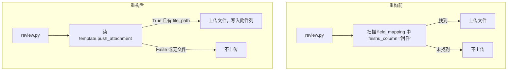

# 附件推送改为模板布尔字段

## 目标

- `document_templates` 增加 `push_attachment BOOLEAN DEFAULT TRUE`
- 审核推送时直接读 `template.push_attachment` 决定是否上传原文件到飞书附件列
- 飞书附件列名硬编码为 `"附件"`，不需要额外配置
- 删除 `template_fields` 里用于触发附件上传的 `attachment` 占位行

## 数据流变化



---

## Step 1 — `supabase/migrations/001_multi_tenant.sql`

**位置**：`CREATE TABLE IF NOT EXISTS document_templates` 内，第 55 行 `auto_approve` 之后

**改动**：插入一行

```sql
-- 原文（第 55-58 行）
    auto_approve BOOLEAN DEFAULT FALSE,   -- 自动通过审核（跳过人工审核直接推送飞书）
    -- 飞书推送配置（每个模板可推送到不同的多维表格）
    feishu_bitable_token VARCHAR(100),    -- 多维表格 app_token
    feishu_table_id VARCHAR(100),         -- 数据表 table_id

-- 改后
    auto_approve    BOOLEAN DEFAULT FALSE,  -- 自动通过审核（跳过人工审核直接推送飞书）
    push_attachment BOOLEAN DEFAULT TRUE,   -- 审核推送时是否上传原文件到飞书附件列
    -- 飞书推送配置（每个模板可推送到不同的多维表格）
    feishu_bitable_token VARCHAR(100),      -- 多维表格 app_token
    feishu_table_id VARCHAR(100),           -- 数据表 table_id
```

---

## Step 2 — `supabase/migrations/002_init_data.sql`

### 2a. 快递单 INSERT（第 33-35 行）— 加 `push_attachment=FALSE`

```sql
-- 原文
INSERT INTO document_templates (id, tenant_id, name, code, description, process_mode, required_doc_count, is_active, sort_order) VALUES
    ('b0000000-0000-0000-0000-000000000002', 'a0000000-0000-0000-0000-000000000001', '快递单', 'express', '外部机构寄达文件快递单', 'single', 1, TRUE, 2)
ON CONFLICT (tenant_id, code) DO NOTHING;

-- 改后
INSERT INTO document_templates (id, tenant_id, name, code, description, process_mode, required_doc_count, push_attachment, is_active, sort_order) VALUES
    ('b0000000-0000-0000-0000-000000000002', 'a0000000-0000-0000-0000-000000000001', '快递单', 'express', '外部机构寄达文件快递单', 'single', 1, FALSE, TRUE, 2)
ON CONFLICT (tenant_id, code) DO NOTHING;
```

### 2b. 照明综合报告 INSERT（第 124-126 行）— 加 `push_attachment=FALSE`

```sql
-- 原文
INSERT INTO document_templates (id, tenant_id, name, code, description, process_mode, required_doc_count, auto_approve, is_active, sort_order) VALUES
    ('b0000000-0000-0000-0000-000000000012', 'a0000000-0000-0000-0000-000000000002', '照明综合报告', 'lighting_combined', '积分球+光分布合并报告', 'merge', 2, TRUE, TRUE, 3)
ON CONFLICT (tenant_id, code) DO NOTHING;

-- 改后
INSERT INTO document_templates (id, tenant_id, name, code, description, process_mode, required_doc_count, auto_approve, push_attachment, is_active, sort_order) VALUES
    ('b0000000-0000-0000-0000-000000000012', 'a0000000-0000-0000-0000-000000000002', '照明综合报告', 'lighting_combined', '积分球+光分布合并报告', 'merge', 2, TRUE, FALSE, TRUE, 3)
ON CONFLICT (tenant_id, code) DO NOTHING;
```

### 2c. 删除 PART 10（第 314-322 行）— 整段删除

```sql
-- 删除以下整段（不再需要）
-- ############################################################
-- PART 10: 检测报告附件字段（用于飞书附件列推送）
-- ############################################################

-- 检测报告新增 attachment 字段，feishu_column = '附件'
-- review.py 会自动上传 PDF 并写入该列
INSERT INTO template_fields (template_id, field_key, field_label, feishu_column, field_type, is_required, sort_order)
VALUES ('b0000000-0000-0000-0000-000000000001', 'attachment', '附件', '附件', 'text', FALSE, 19)
ON CONFLICT (template_id, field_key) DO NOTHING;
```

---

## Step 3 — `api/routes/documents/review.py`

**位置**：约第 170-179 行，飞书推送块中的附件处理

```python
# 原文（删除）
attachment_feishu_col = next(
    (k for k, v in field_mapping.items() if v == "附件"),
    None
)
file_path = document.get("file_path", "")
if attachment_feishu_col and file_path:
    file_token = await feishu_service._upload_file_to_feishu(file_path, bitable_token)
    if file_token:
        push_data[attachment_feishu_col] = [{"file_token": file_token}]

# 替换为
file_path = document.get("file_path", "")
if template.get("push_attachment", True) and file_path:
    file_token = await feishu_service._upload_file_to_feishu(file_path, bitable_token)
    if file_token:
        push_data["attachment"] = [{"file_token": file_token}]
        field_mapping["attachment"] = "附件"
```

---

## 需要手动在已有数据库执行的 SQL

```sql
-- 加列
ALTER TABLE document_templates
    ADD COLUMN IF NOT EXISTS push_attachment BOOLEAN DEFAULT TRUE;

-- 快递单关闭
UPDATE document_templates SET push_attachment = FALSE
WHERE id = 'b0000000-0000-0000-0000-000000000002';

-- 照明综合报告关闭
UPDATE document_templates SET push_attachment = FALSE
WHERE id = 'b0000000-0000-0000-0000-000000000012';

-- 删除旧的 attachment 字段行（如已写入）
DELETE FROM template_fields
WHERE template_id = 'b0000000-0000-0000-0000-000000000001'
  AND field_key = 'attachment';
```
