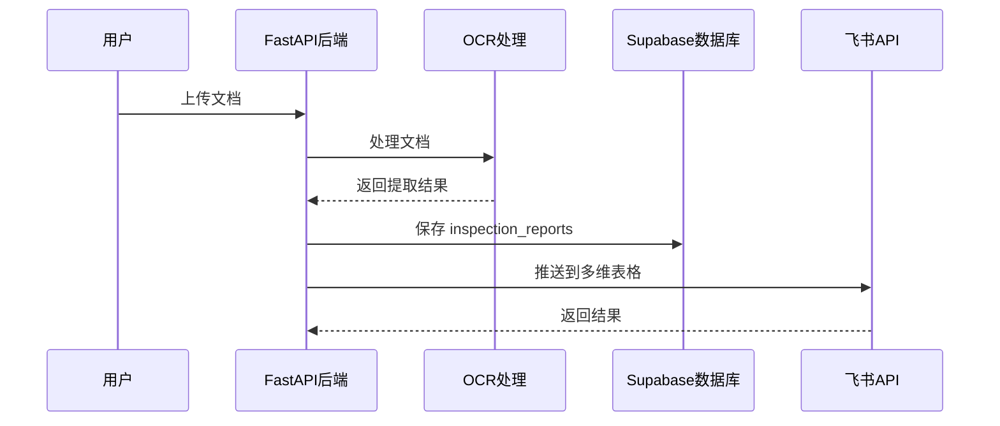

# 飞书多维表格推送实现计划

## 整体架构



## 前置准备（用户需完成）

在飞书开发者后台创建应用并获取以下信息：

- `app_id` 和 `app_secret`（应用凭证）
- 创建多维表格，获取 `app_token` 和 `table_id`

## 实施步骤

### 1. 添加飞书配置到 settings.py

在 [config/settings.py](config/settings.py) 中添加飞书相关配置：

```python
# ============ 飞书配置 ============
FEISHU_APP_ID: str = ""
FEISHU_APP_SECRET: str = ""
FEISHU_BITABLE_APP_TOKEN: str = ""  # 多维表格 app_token
FEISHU_BITABLE_TABLE_ID: str = ""   # 数据表 table_id
FEISHU_PUSH_ENABLED: bool = False   # 是否启用推送
```

### 2. 创建飞书服务模块

新建 [services/feishu_service.py](services/feishu_service.py)，实现：

- 获取 tenant_access_token（应用身份凭证）
- 推送记录到多维表格 API
- 字段映射逻辑

核心 API 调用：

- 获取 token: `POST https://open.feishu.cn/open-apis/auth/v3/tenant_access_token/internal`
- 新增记录: `POST https://open.feishu.cn/open-apis/bitable/v1/apps/{app_token}/tables/{table_id}/records`

### 3. inspection_reports 字段映射

推送以下有效字段到多维表格：

| 数据库字段 | 飞书多维表格列名 | 类型 |

|-----------|-----------------|------|

| sample_name | 样品名称 | 文本 |

| specification_model | 规格型号 | 文本 |

| production_date_batch | 生产日期批次 | 文本 |

| inspected_unit_name | 被检单位 | 文本 |

| inspected_unit_address | 被检单位地址 | 文本 |

| manufacturer_name | 生产商 | 文本 |

| manufacturer_address | 生产商地址 | 文本 |

| task_source | 任务来源 | 文本 |

| sampling_agency | 抽样机构 | 文本 |

| sampling_date | 抽样日期 | 日期 |

| inspection_conclusion | 检验结论 | 单选 |

| inspection_category | 检验类别 | 文本 |

| inspector | 检验员 | 文本 |

| reviewer | 审核人 | 文本 |

| notes | 备注 | 多行文本 |

### 4. 集成到 OCR 处理流程

在 [services/supabase_service.py](services/supabase_service.py) 的 `save_inspection_report()` 方法中，保存成功后调用飞书推送：

```python
async def save_inspection_report(self, document_id: str, data: Dict[str, Any]):
    # ... 现有保存逻辑 ...
    result = self.client.table("inspection_reports").upsert(...).execute()
    
    # 新增：推送到飞书
    if settings.FEISHU_PUSH_ENABLED and result.data:
        await feishu_service.push_inspection_report(result.data[0])
    
    return result.data[0] if result.data else None
```

### 5. 错误处理与重试

- 飞书 API 调用失败不影响主流程
- 记录推送失败日志，支持后续重试
- Token 过期自动刷新

## 用户需要在飞书创建的多维表格结构

在飞书多维表格中创建以下列：

1. 样品名称（文本）
2. 规格型号（文本）
3. 生产日期批次（文本）
4. 被检单位（文本）
5. 被检单位地址（文本）
6. 生产商（文本）
7. 生产商地址（文本）
8. 任务来源（文本）
9. 抽样机构（文本）
10. 抽样日期（日期）
11. 检验结论（单选：合格/不合格/待定）
12. 检验类别（文本）
13. 检验员（文本）
14. 审核人（文本）
15. 批准人（文本）
16. 备注（多行文本）
17. 置信度（数字）

## 环境变量配置

在 `.env` 文件中添加：

```env
FEISHU_APP_ID=cli_xxxx
FEISHU_APP_SECRET=xxxx
FEISHU_BITABLE_APP_TOKEN=xxxx
FEISHU_BITABLE_TABLE_ID=xxxx
FEISHU_PUSH_ENABLED=true
```